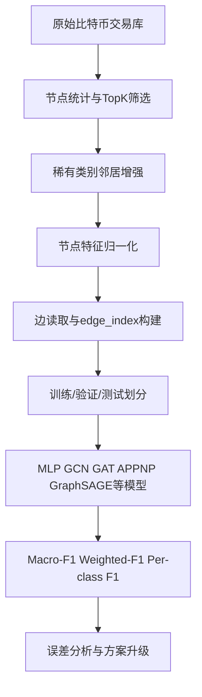

# 2026大学生创新训练计划项目深度研究报告

## 执行摘要

你当前的大创项目已经具备一个**可运行、可复现实验、可展示工程界面**的完整雏形：有子图构建流水线、六类节点分类任务、六个模型基线、统一训练器、W&B 记录和 PyQt5 界面，这对校内中期检查和一般答辩已经是明显优势。与此同时，项目也暴露出一个非常关键的信号：**当前 GraphSAGE 虽是最优 GNN，但 Macro-F1 仍低于 MLP 基线**；再叠加**边特征完全未用、时序信息未建模、标签极度稀疏且长尾严重**，说明项目的真正创新突破口不在于“再多比几个 GNN”，而在于**把问题重新定义为面向真实反洗钱/反诈骗场景的时间感知、边属性感知、极端不平衡半监督图学习问题**。这与近年的金融欺诈图学习综述、时间图欺诈检测、比特币多视图数据集研究趋势是高度一致的。fileciteturn0file1 fileciteturn0file0 citeturn19academia0turn27academia0turn27academia2turn19academia2

从现实需求角度看，这个方向并不“悬空”。Reuters 援引 Chainalysis 的 2026 年报道指出，**2025 年通过加密资产洗钱的规模至少达到 820 亿美元**，且中文洗钱网络增长显著；AP 引述联合国研究指出，**东南亚诈骗产业年化规模接近 400 亿美元**，并持续外溢到全球；Reuters 还报道了**大型加密混币服务被查封**与**柬埔寨诈骗中心持续运转**等事件，说明“链上资金流识别—高风险地址预警—调查线索提纯”是持续升级的现实问题，而不是单纯的课堂练习。把你的项目从“模型复现与比较”升级为“面向真实风险传播和调查支持的预警系统”，是完全站得住脚的故事线。citeturn4news5turn22news4turn18news1turn4news4turn1news1

综合**可行性、创新性、答辩表现力、发表潜力**四个维度，我的结论是：**最值得优先推进的两条路线**分别是  
**其一，边时间感知的动态图风险传播模型**，主打“实际问题、方法升级、结果可解释”；  
**其二，尾类增强的半监督对比学习框架**，主打“标签稀疏、长尾类别、少样本提升”。  
如果你的时间非常紧，建议先完成“**评测修复 + 强基线重建 + 边属性感知模型**”；如果你希望冲击更强的论文故事和更亮眼的答辩，则建议把“**时间感知 + 边特征 + 尾类增强**”组合成一个统一主线。citeturn5academia3turn28academia2turn28academia3turn10academia0

## 原始论文与当前项目梳理

你参考的原始论文实际更接近一篇**毕业设计/项目报告型研究**：它基于大规模比特币交易图，对多种 GNN 做了节点分类比较，并以 Residual GraphSAGE 取得最佳结果；从原始 PDF 可见，完整原始图约有 **2.52 亿节点、7.85 亿边**，标签集里 NONE 占绝大多数，而有标签类包括 INDIVIDUAL、BET、GAMBLING、EXCHANGE、BRIDGE；经过降采样和筛选后，论文最终使用的子图约为 **351,298 个节点和 1,734,735 条交易边**，其中最大的连通子图保留了超过 **98.8%** 的节点。原文报告的最佳半监督模型为 **GraphSAGE + ResNet**，其 **Weighted-F1 为 0.92、Macro-F1 为 0.88**；在作者自己强调的更保守表述里，Residual GraphSAGE 的 **Weighted-F1 为 0.8814、Macro-F1 为 0.74**，优于 GCN、APPNP、EdgeConv 等变体。fileciteturn0file0

与你当前项目相比，最值得注意的不是“结果略差”，而是**数据版本与实验口径出现了显著分歧**。你当前的项目背景说明里写明：现有子图数据约 **350,258 个节点、17,173,503 条边、2,961 个有标签节点**，标签占比仅 **0.85%**；当前已实现六个模型，GraphSAGE 的最好结果为 **Weighted-F1 0.8020、Macro-F1 0.6725**，而 **MLP-4 层的 Macro-F1 反而达到 0.7020**。这意味着现在的项目结论已经与原始论文形成关键差异：**图结构收益不稳，甚至可能被特征基线反超**。这不是坏事，反而是你最有价值的研究入口，因为近年的严格时序评测工作也开始质疑“GNN 一定优于特征模型”的旧结论。fileciteturn0file1 fileciteturn0file0 citeturn5academia3

为了让项目答辩和论文叙事更清晰，你可以把“原始论文流程”和“当前代码流程”统一抽象为下面这条链路。这个流程图不是简单复述，而是后续改进设计的母版。原始论文和你的项目现状都说明：目前的核心瓶颈集中在**子图选择偏置、边与时序信息缺失、尾类学习不足**三个环节。fileciteturn0file0 fileciteturn0file1

下面这张表把“原始论文”和“你当前项目状态”直接对齐，便于你答辩时一句话讲清楚“我不是从零做模型，而是在**复现基础上发现矛盾，并据此提出新的研究问题**”。表中最重要的不是数值本身，而是最后一列“研究含义”。fileciteturn0file0 fileciteturn0file1

| 维度 | 原始论文/原始报告 | 你当前项目状态 | 研究含义 |
|---|---|---|---|
| 原始图规模 | 约 2.52 亿节点、7.85 亿边 | 沿用同一问题设定 | 任务本身是大规模真实图，不是玩具数据 |
| 降采样后子图 | 351,298 节点、1,734,735 边 | 350,258 节点、17,173,503 边 | **版本差异明显，必须解释复现口径** |
| 标签体系 | NONE + 5 个目标类 | NONE + 5 个目标类 | 多分类而非简单二分类，更接近实际业务角色识别 |
| 稀缺类别 | BRIDGE 极少，GAMBLING 很少 | BRIDGE/GAMBLING 仍是核心痛点 | 长尾是主矛盾，不是附带问题 |
| 最优 GNN | Residual GraphSAGE | GraphSAGE | 仍以 SAGE 系列为主干最合理 |
| 当前最强结果 | 原文 Macro-F1 0.74 / Weighted-F1 0.8814 | 当前 GraphSAGE Macro-F1 0.6725 | 复现后未稳定重现，需要重新审视评测与数据 |
| 图是否真正有帮助 | 原文倾向“有帮助” | 当前 MLP 的 Macro-F1 更高 | **这是论文级问题，而不是失败** |

还有一个容易被忽略但非常重要的细节：原始 PDF 在不同模型设定上采用了**不完全一致的训练划分口径**。比如文中半监督 GCN 一处使用“每类 20 个有标签节点训练”的设置，GCN + graph regularization 又采用“每类 80% 标注节点训练”的设定；而你当前项目则使用了互斥分层划分，并以验证集 Macro-F1 做早停。这说明“结果表”之间并不天然可横向比较，**评测协议本身就需要被修正和统一**。这类“协议不一致导致比较不公平”的问题，正是严肃实验论文会重点指出的地方。fileciteturn0file0 fileciteturn0file1

## 相关文献与现实问题图景

近两年的文献已经明显从“只在 Elliptic 风格数据上比几个 GNN”转向三个更成熟的方向：**更大的公开数据、更严格的时间评测、更贴近业务的风险传播/调查任务**。一篇 2024 年综述系统梳理了金融欺诈图学习领域，指出时间动态、多关系异构、标签稀疏、可解释与部署落地，是目前方法设计的真正挑战；换句话说，你现在想做的“从模型对比转向实际问题求解”，不是脱离主流，恰恰是**对齐主流**。citeturn19academia0

在数据侧，公共资源已经比早期 Elliptic 体系丰富得多。2023 年 Elliptic++ 把任务从“单一交易视角”扩展为**地址图、交易图、地址-交易图、实体图**四种图视角；2024 年 ORBITAAL 提供了覆盖 **2009–2021** 的 Bitcoin 实体-实体时间图；2024 年 “Bitcoin Research with a Transaction Graph Dataset” 提供了 **2.52 亿节点、7.85 亿边** 的大规模监督任务与代码；2025 年 “The Temporal Graph of Bitcoin Transactions” 进一步给出了超过 **24 亿节点、397.2 亿边** 的机器学习兼容时间异构图；另一条线上的 BABD-13 则提供了 **54 万余个标注地址、148 个特征、13 类行为标签**，适合做辅助预训练或外部泛化验证。对于一个大创项目而言，这意味着你完全可以把论文故事扩成：**先在自己图上做核心实验，再用公开大数据做泛化或补充验证**。citeturn19academia2turn19academia1turn15view0turn27academia1turn14academia4

为了后续实验和答辩方便，建议优先关注下列数据/资源：  

| 资源 | 你可用来做什么 | 推荐用途 |
|---|---|---|
| Elliptic++ | 四种图视角、地址/交易联合分析 | 做多视图/异构图扩展与外部对照 |
| ORBITAAL | 实体级时间图 | 做时间切分和长期漂移评测 |
| Bitcoin Research with a Transaction Graph Dataset | 大规模地址类型预测与代码复现 | 做额外泛化验证与论文资源引用 |
| The Temporal Graph of Bitcoin Transactions | 极大规模动态图 | 做“高影响但不必全部实现”的远期路线 |
| BABD-13 | 多类行为标签与丰富统计特征 | 做特征工程、预训练或对照实验 |

上表对应的资源与论文来源分别见 Elliptic++、ORBITAAL、Bitcoin Research 数据集、Temporal Graph of Bitcoin Transactions 与 BABD-13 的作者页面和摘要。citeturn19academia2turn19academia1turn15view0turn27academia1turn14academia4

在方法侧，与你项目最相关的“近五年有效思路”大致可以压缩成四类。第一类是**时间图方法**，如 TGN/GTAN 一类模型，用边到达顺序和时间衰减建模风险传播；第二类是**长尾与不平衡学习**，从 survey 到 Uni-GNN、GraphSB，都指出仅靠 weighted cross-entropy 往往不够，结构不平衡本身也会放大多数类优势；第三类是**异质/多视图图学习**，尤其适合比特币这类交易、地址、实体、聚类角色并存的问题；第四类是**主动学习与可解释性**，开始强调“少标注条件下如何高效请求标签”和“模型给出的高风险节点如何让人类分析员信服”。这些文献方向与你已有的 A/B/C 设想高度重合，说明你现在不是缺方向，而是需要把方向聚焦成可讲清楚的主线。citeturn27academia0turn27academia2turn28academia2turn28academia3turn28academia0turn13academia1turn21academia2

从现实问题映射看，近年的研究也在从“地址分类”走向“**资金流追踪、诈骗团伙发现、暗网活动画像、跨平台情报融合**”。例如，关于暗网加密滥用和诈骗资金流的研究已经能从站点、地址、活动簇三个层面发现关联模式；DeFi 犯罪研究则开始构建事件 taxonomy；这说明你如果仍停留在“哪个 GNN Macro-F1 高 2 个点”，评委很容易觉得“只是在比模型”。相反，如果你把项目目标换成“**高风险节点预警 + 团伙传播分析 + 人工甄别效率提升**”，研究意义会立刻上一个台阶。citeturn23academia12turn23academia14turn23academia7

## 原论文与当前实现的关键不足

先说最关键的学术问题：**当前项目还不构成足够强的论文创新点**。原始论文/报告的核心贡献主要是“构建数据子图 + 比较多种 GNN + 做一些残差增强”，这在本科项目里是合格的，但在会议论文标准下通常只能算**工程复现与增量调参**。近年的综述已经把领域前沿转向时序、异构、长尾、主动学习和解释性部署，因此你若继续沿用“再比几个 GNN 主干”的思路，创新上很难站住脚。fileciteturn0file0 citeturn19academia0

第二个问题是**图结构贡献目前并不可信**。你当前实验里 MLP 的 Macro-F1 高于 GraphSAGE，这并不一定意味着“图没用”，但它至少意味着“当前使用图的方式有问题”。更进一步，2026 年一篇针对比特币欺诈检测评测协议的再审视工作明确指出，在严格的**时间归纳式评估**下，特征模型可能反而优于多个经典 GNN，且训练时暴露测试期邻接关系会显著夸大 GNN 效果。你的现象与这类最新批判性结果高度同构，因此项目下一步的首要任务不是盲目上更复杂模型，而是先把**评测协议修正到可信状态**。fileciteturn0file1 citeturn5academia3

第三个问题是**边特征与时间信息被系统性浪费**。你当前数据里本来就有 `total`、`min_sent`、`max_sent`、`total_sent`、`last_seen` 等信息，原始论文和现有项目却基本都把消息传递简化成“只用 node feature + adjacency”。这等于把“交易网络”错误地当成了“普通静态社交图”。而 GNN 的一般消息传递形式本来就允许把边属性融入消息函数；金融异常检测的新方法也反复证明，边与时间往往比纯拓扑更贴近真实风险。换句话说，你现在最大的“白捡创新”其实就在已有字段里。fileciteturn0file1 citeturn12search4turn27academia0turn27academia2

第四个问题是**长尾不平衡不仅是样本问题，还是结构问题**。你的项目已经用了 weighted cross-entropy 和 focal loss，但这只是“损失函数层面”的补丁。近期图不平衡研究指出，少数类节点在图中往往还同时面临**邻域稀疏、结构被多数类包围、消息传播时被同化**等问题，因此仅靠改 loss 往往救不了 BRIDGE 或 GAMBLING。你现在看到 GAMBLING F1 很低，不应理解成“调参没调好”，而应理解成“**需要专门的尾类学习机制**”。fileciteturn0file1 citeturn28academia2turn28academia3turn28academia0

第五个问题是**数据子图构造存在潜在偏置与复现风险**。原始论文采用了基于 degree、进出交易量、cluster size 的重要性筛选，你当前实现也有类似 TopK + BRIDGE 邻居增强策略。这一策略在工程上合理，但在研究上会引出两个追问：其一，是否因为“先验筛选”而抬高了某些类别的可分性；其二，为什么原始 PDF 和你当前代码输出在边数、标签规模、训练协议上会有明显不一致。只要你在报告里主动承认并修复这些问题，评委通常不会扣分；相反，若不解释，这会直接伤害项目可信度。fileciteturn0file0 fileciteturn0file1

最后一个问题是**缺少“真正的实际问题定义”**。现实里的风控/反洗钱系统通常不会只问“节点六分类准确率是多少”，它更关心的是：**高风险节点能否在 Top-K 名单中尽早浮现、是否能解释为何可疑、是否能在人力有限时优先挑出最值得复核的样本**。你当前项目若想在答辩里吸引评委，必须把指标与故事线从“分类准确率”扩展到“风险排序、早期预警、尾类发现、可解释调查支持”。这一步并不要求你真的落地到公安/交易所系统，但要在问题定义上**向真实业务靠近**。citeturn19academia0turn21academia2turn4news5turn22news4

## 分层改进方案

下面给出六条可行改进路线。我按**短期可实现—中期有创新—长期高影响**组织，并明确标出了我最推荐的两条。这里的“时间估计”按学生项目常见节奏估算，默认你已有当前代码基础；若有单张 16–24GB GPU，整个节奏会明显加快。fileciteturn0file1

| 层级 | 方案 | 技术路线 | 所需数据与资源 | 预期创新点 | 可量化评估指标 | 潜在风险与应对 | 实现难度与时间估计 |
|---|---|---|---|---|---|---|---|
| 短期 | **评测修复与强基线重建** | 统一时间归纳式划分；重跑 MLP、XGBoost/LightGBM、GraphSAGE、APPNP；加入 PR-AUC、ECE、Top-K Recall | 现有图 + 时间字段即可 | 从“复现”升级为“可信 benchmark”；解释为何 MLP 反超 GNN | Macro-F1、Macro-PR-AUC、ECE、Top-K Recall | 可能发现 GNN 优势更弱；应对方式是把结论重构为“严格评测下图结构何时有效” | 低到中；约 1–2 周 |
| 短期 | **边属性感知 GraphSAGE++** | 为 edge_attr 建 MLP 编码器；用 edge-aware attention / GINE 式消息传递；节点与边联合建模 | 你已有 6 维边特征，几乎零额外采集成本 | 直接补上当前最明显缺口，性价比极高 | Macro-F1、GAMBLING/BRIDGE F1、消融提升幅度 | 边特征噪声大；先做 log1p、winsorize、分桶与消融 | 中；约 2–4 周 |
| 中期 | **边时间感知动态图风险传播网络** ★ | 时间窗口切分 + temporal neighbor sampling；边金额/频率/新鲜度编码；TGN/GTAN 或 snapshot-TGNN | 需要时间字段、建议有 GPU | 从静态分类升级为“预警式”动态风险传播 | Forward-chaining Macro-F1、Recall@K、AUPRC、早期检测提前量 | 动态图工程复杂；先做 snapshot 版本，再迭代到 TGN | 中到高；约 4–8 周 |
| 中期 | **尾类增强的半监督对比学习** ★ | supervised contrastive loss + balanced pseudo-labeling + minority structural augmentation | 现有标签 + 大量未标注节点 | 聚焦解决 GAMBLING/BRIDGE 低 F1，论文亮点明确 | Tail Macro-F1、G-mean、Balanced Accuracy、少样本增益 | 伪标签漂移；用校准阈值、教师-学生一致性、双模型投票 | 中；约 3–6 周 |
| 中期偏长期 | **多视图异构图建模** | 构建 address-address、address-transaction、cluster/entity 多图或异构图；关系注意力融合 | 需要更多预处理，但不用新增外部标注 | 更接近真实资金流语义与实体角色 | Macro-F1、跨图泛化、解释质量 | 图爆炸与训练成本高；可先从双视图开始 | 高；约 6–10 周 |
| 长期高影响 | **主动学习 + 可解释调查工作台** | 不确定性/多样性采样选点；子图解释；集成到现有 GUI | 需要导师/同学参与少量复核 | 从“分类器”升级为“人机协同风控原型” | 每 100 个新增标注带来的性能提升、案例解释可接受度 | 缺人工标注；可先用模拟 oracle，再做演示版 | 高；约 6–12 周 |

这些方案不是拍脑袋的“功能堆砌”，而是直接对应近年文献中的四类主线问题：**严格时序评测**、**时间图欺诈检测**、**图不平衡学习**、**少标注下的主动学习与解释性**。因此，即便你最后只实现其中两三项，也足以把项目从“模型比较”升级为“问题驱动、方法成体系”的研究。citeturn5academia3turn27academia0turn27academia2turn28academia2turn28academia3turn28academia0turn13academia1turn21academia2

如果只从“**最有机会拿奖/最能发文/最适合你现有代码基础**”三个标准选，我建议这样排序：  
**综合价值最高**：边时间感知动态图风险传播网络。  
**性价比最高**：尾类增强的半监督对比学习。  
**最稳的短期加分项**：评测修复 + 边属性感知 GraphSAGE++。  
前两者适合作为论文主线与详细实验设计对象；第三者则几乎应当作为无论选哪条主线都要先做的“地基工程”。fileciteturn0file1 citeturn27academia0turn27academia2turn28academia3

## 最优两条方案的详细实验设计

### 方案一

**方案名称**：边时间感知动态图风险传播网络。  
**推荐定位**：主线方案，最适合讲“实际问题意义”。  

**数据预处理**：  
把现有 19 维节点特征和 6 维边特征全部纳入统一预处理。金额类特征如 `total_in`、`total_out`、`total`、`total_sent`、`min_sent`、`max_sent` 建议先做 `log1p`，再做 winsorize 或按训练集分位数截断，最后做 Z-score；时间字段如 `last_seen`、首末交易区间或块高度差转成**相对时间差**与**时间新鲜度**特征；所有归一化统计量必须只在训练时间窗口上拟合，验证和测试只能复用训练统计量，避免时间泄漏。若你只能做静态图第一版，那么至少也要把 `last_seen` 转成 recency 节点/边特征；若能升级，则按月或按季度建立 snapshot 序列，并采取 forward-chaining 切分：较早时间训练，中间时间验证，较晚时间测试。这样不仅更真实，也能直接回应“MLP 为何反超 GNN”的质疑。fileciteturn0file1 citeturn5academia3turn27academia0turn27academia2

**模型架构**：  
推荐从“两级版本”实现。第一级是**静态边感知基线**：`NodeEncoder(19→d)` + `EdgeEncoder(6或6+time→de)` + 边感知消息传递层（可用 GINE 风格、edge-aware attention，或自己在 SAGE 消息函数里拼接边编码）+ 残差 + LayerNorm + Jumping Knowledge；第二级是**时间动态图版本**：在第一级基础上引入时间记忆单元或 temporal attention，形成 snapshot-TGNN 或 TGN/GTAN 风格结构。输出端不要只做 hard classification，建议同时输出**类别 logit**和**风险分数**，后者有利于答辩展示 Top-K 预警能力。损失函数可采用 `weighted focal loss + label smoothing`，并对尾类设置更敏感的权重。citeturn12search4turn27academia0turn27academia2

**训练与验证流程**：  
训练阶段采用 temporal neighbor loader 或按快照分批训练；验证指标以 **Macro-F1** 为主，辅以 **Macro-PR-AUC** 和 **Recall@Top-K**。如果你想让项目更有“业务感”，可以把测试集上的高风险节点排序后，统计前 1%、前 5%、前 10% 样本中命中的 GAMBLING/BRIDGE 比例。早停应基于验证集的 Macro-F1 与 Tail Recall 的加权综合，而不是单纯看 Overall Accuracy。每个实验至少跑 **5 个随机种子**，保留均值与标准差。citeturn19academia0turn27academia0

**基线对比**：  
至少应包含四层：  
第一层，**特征模型基线**：MLP-2、MLP-4、XGBoost/LightGBM；  
第二层，**你现有图模型基线**：GCN、GAT、APPNP、GraphSAGE、ResGraphSAGE；  
第三层，**单因素增强模型**：只加边特征、不加时间；只加时间、不加边特征；  
第四层，**完整模型**：边 + 时间 + 残差 + class-balance。  
这样做的好处是，任何评委问“到底是哪一部分有用”，你都能用实验而非口头解释回答。fileciteturn0file1 citeturn5academia3turn27academia2

**消融实验**：  
建议至少做六个消融：  
去掉边编码；去掉时间编码；去掉残差；去掉 class-balanced loss；去掉 Top-K 风险排序头；把时间切分换回随机切分。最后一个消融尤其关键，因为它能直观看出“随机切分是否夸大了模型效果”。在答辩时，这会非常加分。citeturn5academia3

**统计显著性检验**：  
对 5 个或 10 个随机种子的 Macro-F1、Tail Macro-F1 做**配对 t 检验**；若样本量太小或分布不稳，则改用 **Wilcoxon signed-rank test**。对测试集逐节点预测差异，可在“完整模型 vs 最强基线”之间补充 **McNemar 检验**。此外，建议对 Macro-F1 与各尾类 F1 做 **1000 次 bootstrap 置信区间**。论文里报告“均值 ± 标准差 + p 值 + 95% CI”，会比只报单次最好结果专业很多。  

### 方案二

**方案名称**：尾类增强的半监督对比学习框架。  
**推荐定位**：副主线或与方案一组合，最适合讲“少标签、极端长尾、稀有行为识别”。  

**数据预处理**：  
保留你当前全图/大子图设置，但一定要先完成**训练—验证—测试口径统一**。节点与边特征处理可沿用方案一；此外，对**尾类样本邻域**单独做结构审计：统计 1-hop/2-hop 内不同类别占比、平均同类邻接率、局部聚类系数和邻域熵。若你发现 GAMBLING/BRIDGE 主要被多数类邻居包围，那么这个结果本身就是使用对比学习与结构增强的证据。fileciteturn0file1 citeturn28academia2turn10academia0

**模型架构**：  
推荐主干继续采用你最熟悉的 GraphSAGE 或其双通道变体，但在损失函数和训练策略上升级。总体目标函数可写成：  
`L = L_cls + λ1 L_supcon + λ2 L_pseudo + λ3 L_balance`。  
其中 `L_cls` 是 weighted CE 或 focal；`L_supcon` 是监督对比损失，把同类样本拉近、异类样本拉远；`L_pseudo` 用于高置信未标注节点的伪标签学习；`L_balance` 用于约束伪标签类别分布不过度向多数类倾斜。若你愿意再进一层，可把骨干替换为**异配性更稳健**的双通道结构，例如“aggregation + diversification + identity”三通道思路，或在 GraphSAGE 之外增加一条 semantic similarity 图分支。这样能更好处理“诈骗/桥接节点往往与普通节点强连接”的场景。citeturn13academia3turn10academia0turn13academia2turn28academia3

**训练与验证流程**：  
建议分三阶段训练。  
第一阶段：只用已有标注做监督训练，得到稳健 backbone；  
第二阶段：在未标注节点中筛高置信伪标签，但不是全收，而是按类别上限做**平衡扩充**，避免多数类继续淹没尾类；  
第三阶段：用“原标注 + 伪标签 + 对比学习”联合微调。  
每轮伪标签更新后都用验证集检查**GAMBLING/BRIDGE 的 Precision 是否先崩掉**；如果伪标签让尾类精度明显下降，就抬高置信阈值或取消该轮扩充。你甚至可以采用双模型一致性：只有 MLP 和 GNN 同时高置信时才纳入伪标签，这会显著减少噪声。citeturn13academia3turn28academia3

**基线对比**：  
这里的基线不该只是“不同 backbone”，还应包括“不同策略组合”：  
GraphSAGE + weighted CE；  
GraphSAGE + focal；  
GraphSAGE + pseudo-label only；  
GraphSAGE + sup-contrast only；  
GraphSAGE + balanced sampler only；  
你的完整模型。  
这会让论文故事非常清楚：**不是 backbone 换了就变强，而是尾类友好的训练机制真的有效**。fileciteturn0file1 citeturn28academia2turn28academia0

**消融实验**：  
重点做五项：  
去掉对比学习；去掉平衡伪标签；去掉结构增强；去掉尾类重加权；把高置信阈值从 0.95、0.90、0.85 逐级下调。你最终很可能会发现：**阈值过低时总体 F1 涨，但尾类 precision 掉得很快**。这个“曲线式结论”比简单表格更有论文味道，也更能说明你理解了方法边界。  

**统计显著性检验**：  
与方案一相同，建议报告种子均值、标准差、配对检验与 bootstrap 置信区间；但在此基础上，再增加一项**尾类单独显著性分析**，即只对 GAMBLING 与 BRIDGE 的 F1 做配对检验。因为你的核心 claim 不是“总体提升”，而是“**尾类显著提升**”。  

综合比较，这两条方案分别代表了两种很强的论文叙事：  
方案一讲的是“**更贴近真实链上风险传播**”；  
方案二讲的是“**更贴近少标签长尾学习本质**”。  
如果你最终只能做一条，我更建议以**方案一为主、方案二做辅助模块**，因为这会让项目在答辩里更容易被理解成“解决实际问题”，而不只是“技巧上改 loss”。citeturn27academia0turn27academia2turn28academia3

## 答辩展示与投稿建议

答辩时，最怕把项目讲成“我比较了几个模型，最后某个模型最高”。你真正应该讲的，是这样一条故事线：  
**第一，原始论文告诉我们 GNN 可以做比特币风险识别；第二，我复现后发现图模型并没有稳定优于 MLP；第三，这个矛盾启发我意识到问题不在‘换更深模型’，而在‘交易语义与时间信息没被用好、评测协议不够严格、尾类被多数类淹没’；第四，我据此把任务升级为面向真实预警的边时间感知、长尾友好的风险传播识别。**  
这条线会让评委觉得你不是在“重复论文”，而是在“通过复现发现问题并提出新问题”。fileciteturn0file1 fileciteturn0file0 citeturn5academia3turn19academia0

答辩 PPT 的重点页我建议固定成七张：  
第一张，现实背景与真实案例，说明为什么链上资金流识别重要；  
第二张，你复现得到的关键矛盾：MLP Macro-F1 高于当前 GNN；  
第三张，问题诊断图：边没用、时序没用、长尾严重、评测可能泄漏；  
第四张，你的核心创新框架图；  
第五张，主结果表 + Tail class 曲线；  
第六张，案例子图解释，展示一个高风险 BRIDGE/GAMBLING 节点周围的交易模式；  
第七张，系统原型或 GUI 展示，说明可落地性。  
这一套组合比单纯堆表格更能打动评委。fileciteturn0file1 citeturn4news5turn18news1

下面是我建议你一定要生成的图表类型。它们几乎对应了答辩中的每个“高频追问”。  

| 图表类型 | 建议展示内容 | 目的 |
|---|---|---|
| 长尾类别分布条形图 | 五个有效类别样本数、训练/验证/测试占比 | 一眼说明问题难度 |
| 时间切分示意图 | 训练期、验证期、测试期时间轴 | 正面回应“是否泄漏” |
| PR 曲线 | 尤其是 GAMBLING、BRIDGE | 比 ROC 更适合稀有类别 |
| 混淆矩阵 | 当前最强模型 vs 基线 | 说明错误类型 |
| 消融瀑布图 | 去掉边、去掉时间、去掉对比损失后的性能变化 | 证明每个模块都必要 |
| UMAP/t-SNE 嵌入图 | 不同类别嵌入分离度、误分类点高亮 | 让评委直观看到表征变化 |
| 风险排序命中曲线 | Top-K 中命中的高风险节点比例 | 把学术指标转换成业务价值 |
| 可靠性图 | calibration / ECE | 说明高风险分数是否可信 |
| 典型案例子图 | 某个误报/漏报/正确命中的交易传播链 | 提升可解释性与展示感 |

投稿目标方面，我建议你**至少准备两个梯度**：  
一个是“理想目标”，用于倒逼实验标准；  
一个是“现实目标”，用于真正投稿。  
如果你的结果只是“边特征 + 少量改动 + 单数据集提升”，更适合偏应用的数据挖掘/智能系统期刊；如果你能做到“严格时间评测 + 新方法 + 尾类显著提升 + 多数据集泛化/案例解释”，则可以考虑更强的会议或中文顶刊。下面这份清单里，**会议等级是按国内常用学术定位和本文主观难度判断**，**期刊 IF 采用公开页面可见值或近年公开指标**，可能与最新 JCR/知网有小幅时间差。citeturn25search1turn25search0turn25search2turn29search1

| 目标 venue | 类型 | 等级/指标 | 适配度 | 投稿难度评估 |
|---|---|---|---|---|
| KDD | 会议 | 顶会级 | 若你做出严格时间评测 + 新方法 + 大规模泛化，可冲 | 极高 |
| The Web Conference | 会议 | 顶会级 | 若强调网络犯罪传播、图挖掘与真实案例，可考虑 | 极高 |
| ICDM | 会议 | 强会级 | 最适合“图挖掘 + 金融欺诈 + 实验扎实”的方案 | 高 |
| CIKM | 会议 | 强会级 | 适合多视图、检索、知识增强或异构图版本 | 高 |
| Information Sciences | 期刊 | IF 8.233 的公开页面值 citeturn25search0 | 适合完整方法 + 强实验 | 高 |
| Knowledge-Based Systems | 期刊 | IF 8.038 的公开页面值 citeturn25search2 | 适合方法型工作，尤其模型创新清晰时 | 高 |
| IEEE Access | 期刊 | IF 3.6 的公开页面值 citeturn25search1 | 适合工程完整、应用明确、结果充分的大创升级稿 | 中 |
| 计算机学报 | 中文期刊 | 2024 复合影响因子 6.781，且在公开信息中属 T1 citeturn29search1 | 若你更希望中文高质量产出，这是很有分量的目标 | 很高 |
| 计算机研究与发展 | 中文期刊 | 领域强刊，适合系统扎实的中文稿件 | 若有完整协议、消融与理论动机，可尝试 | 高 |

如果你问我更现实的投稿顺序，我会给出这样一个建议：  
**优先现实目标**：ICDM/CIKM/IEEE Access/中文强刊。  
**冲击型目标**：KDD/WWW。  
以大创项目周期看，只要你把“评测修复 + 主线方法 + 完整消融 + 案例解释”做齐，投稿到 ICCM/CIKM 同层级会议或较强应用期刊并非空想；但如果仍停留在“换 backbone 对比”，那更适合校内项目而不是外部论文。citeturn19academia0turn5academia3

## 参考文献与优先阅读顺序

下面按“**必须先读—随后精读—扩展阅读**”的顺序给出文献表。优先级不是按论文影响力排，而是按**你当前项目最需要解决的问题**排。

| 优先级 | 文献或资源 | 你为什么要先读 |
|---|---|---|
| 最高 | 你当前项目背景说明与代码结构梳理 fileciteturn0file1 | 这是所有改进设计的真实约束条件 |
| 最高 | 原始论文/毕业设计报告 `Identification of Illicit Bitcoin Transactions Based on Graph Neural Network` fileciteturn0file0 | 必须准确梳理原始方法、协议与结果，避免“批评错对象” |
| 最高 | *When Graph Structure Becomes a Liability: A Critical Re-Evaluation of GNNs for Bitcoin Fraud Detection under Temporal Distribution Shift* citeturn5academia3 | 直接对应你现在“MLP 反超 GNN”的核心矛盾 |
| 最高 | *Graph Neural Networks for Financial Fraud Detection: A Review* citeturn19academia0 | 给你完整研究地图，帮你确定创新落点 |
| 高 | *Semi-supervised Credit Card Fraud Detection via Attribute-Driven Graph Representation* citeturn27academia2 | 学时间图 + 半监督 + 风险传播的组合思路 |
| 高 | *Temporal Graph Networks for Graph Anomaly Detection in Financial Networks* citeturn27academia0 | 学动态图评测和建模框架 |
| 高 | *Demystifying Fraudulent Transactions and Illicit Nodes in the Bitcoin Network for Financial Forensics* citeturn19academia2 | 学比特币多视图图建模，决定你是否做异构/多图扩展 |
| 高 | *Revisiting Heterophily For Graph Neural Networks* citeturn10academia0 | 学为什么“邻居并不总是同类”，这对诈骗/桥接节点很关键 |
| 高 | *A Survey of Imbalanced Learning on Graphs* citeturn28academia2 | 学什么叫图上的长尾问题，不要只停留在 weighted CE |
| 高 | *Overcoming Class Imbalance: Unified GNN Learning with Structural and Semantic Connectivity Representations* citeturn28academia3 | 学结构不平衡与语义连边如何一起处理 |
| 高 | *GraphSB: Boosting Imbalanced Node Classification on Graphs through Structural Balance* citeturn28academia0 | 学尾类邻域增强与结构平衡的具体做法 |
| 中 | *Pseudo Contrastive Learning for Graph-based Semi-supervised Learning* citeturn13academia3 | 学伪标签和对比学习如何结合 |
| 中 | *Class-Balanced and Reinforced Active Learning on Graphs* citeturn13academia1 | 如果你想把项目升级成人机协同方案，这篇很重要 |
| 中 | *ORBITAAL: A Temporal Graph Dataset of Bitcoin Entity-Entity Transactions* citeturn19academia1 | 学时间图数据组织方式，便于你重构数据流水线 |
| 中 | *Bitcoin Research with a Transaction Graph Dataset* citeturn15view0 | 公开数据与代码资源，对外部验证很有用 |
| 中 | *The Temporal Graph of Bitcoin Transactions* citeturn27academia1 | 长期高影响路线的资源入口 |
| 扩展 | *BABD: A Bitcoin Address Behavior Dataset for Pattern Analysis* citeturn14academia4 | 适合做多类地址行为外部对照或预训练 |
| 扩展 | *The Devil Behind the Mirror* citeturn23academia12 | 适合把项目叙事扩展到黑产活动簇发现 |
| 扩展 | *From Tweet to Theft* citeturn23academia14 | 适合理解“链上追踪 + 场景解释”的写法 |
| 扩展 | *Mapping the DeFi crime landscape* citeturn23academia7 | 适合写引言和现实意义部分 |

最后补充两点开放限制。第一，你尚未给出**导师要求、时间表、算力条件、是否允许引入外部公开数据**，因此上面的时间估计与投稿建议是按“本科大创常规条件”给出的；第二，中文官方资料在这次公开检索中获取质量不如英文高，但你完全可以在正式论文或答辩中用**学校项目材料 + 原始论文 + 联合国/Reuters/AP 等权威外部来源**来完成“现实意义”论证，而不必被“必须找到中文官方同类数据”卡住。就你当前项目基础而言，最关键的不是继续搜更多材料，而是立刻把项目主线锁定为：**严格评测、边时间建模、尾类提升、案例解释**。fileciteturn0file1 citeturn4news5turn22news4turn18news1

navlist近两年加密犯罪与监管动态turn4news5,turn18news1,turn22news4,turn1news1,turn4news4