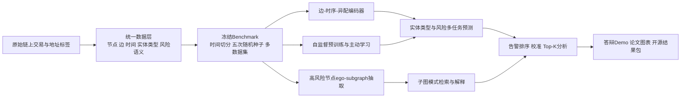

# 2026大学生创新训练计划项目深度研究报告

## 执行摘要

当前主题已经明确，不属于“主题未指定”的情况。根据你上传的材料，你现在做的本质不是泛泛的“GNN 复现”，而是在比特币交易网络上进行**半监督节点分类 / 地址行为识别**：当前处理后的图大约有 **35 万级节点、1700 万级边**，但只有 **2961 个带标签节点，标签占比约 0.85%**；标签空间包含 `INDIVIDUAL`、`BET`、`GAMBLING`、`EXCHANGE`、`BRIDGE` 等类型；当前最佳 GNN 为 GraphSAGE，`Macro-F1≈0.6725`，而 4 层 MLP 可达到 `Macro-F1≈0.7020`，并且现阶段模型**尚未使用 6 维边特征**。这说明你手里其实已经有了一个很适合做研究升级的“原材料”——**低标签、动态图、异配图、边属性可用、实际风险相关**——只是现在的题目描述和实验设计还没有把它提炼成一个有研究味道的科学问题。fileciteturn0file1

从国际公开主线看，这个方向在 2019—2025 年已经明显从“模型对比”转移到了四条更深的路线：**边属性与时序建模**、**低标签/自监督学习**、**子图级洗钱形状识别**、以及**面向落地的实时分析系统**。Elliptic 数据集的原始工作已经表明，在早期设置中 Random Forest 甚至强于 GCN；后续研究则分别沿着自监督（Inspection-L）、边属性有向多重图（DIAM）、子图级 AML（Elliptic2）、跨平台泛化与对比学习（ShadowEyes）、以及实时图特征预处理与高吞吐部署（Graph Feature Preprocessor）持续推进。换句话说，你最不应该继续做的，是再多堆几个 GNN 层去赢一个 0.x 的指标；你最应该做的，是把项目重构成一个**“面向低标注动态比特币交易图的风险识别与可解释预警”**问题。citeturn20view0turn21view0turn20view4turn20view3turn31view0turn23view1turn37view2

如果只给一个最核心判断，我的建议是：**主论文路线做“边-时序-异配感知的多任务风险识别”，答辩展示路线做“子图解释 + 可交互 demo”，保底工程路线做“图特征预处理 + GBDT/MLP/GNN 混合系统”**。这三者共享一套可复现 benchmark，就能同时满足“学术性、实用性、可展示性”三条线。只按现有方案继续推进，你的项目大概率停留在“模型复现与对比”层面；按本文建议重构后，它有现实机会冲击一篇**应用导向的数据挖掘/图学习会议论文**，同时在大创答辩里更容易打动评委。

## 项目主题与总体判断

我建议你先在项目叙事上做一次“正名”。你现在的工作对象其实是**节点/地址/实体行为类型**，而不是严格意义上的“交易级识别”；同时标签里既有明显高风险类别，也有中性或基础角色类别，因此它更接近“**实体行为分类 + 风险预警**”，而不是狭义的“非法交易二分类”。这不是文字游戏，而是科学问题定义。如果标题、任务对象、标签语义不一致，评委会第一时间追问“你到底识别的是交易、地址、实体，还是风险服务类型”，这会直接削弱项目可信度。你上传的项目背景也已经显示，目前标签空间本身就是多类实体/行为类型，而不是纯粹 licit / illicit 二分类。fileciteturn0file1

因此，我建议把题目改成下面这种风格之一，而不是继续沿用“图神经网络非法交易识别”这种笼统表述：

| 版本 | 建议题目 | 为什么更好 |
|---|---|---|
| 学术版 | 面向低标注动态比特币交易图的边时序感知风险识别 | 直接点出低标签、动态图、边与时间信息，是研究问题而非工具描述 |
| 答辩版 | 基于图学习的比特币地址行为识别与可解释风险预警 | 更容易让评委理解“做什么、解决什么问题、如何可视化” |
| 投稿版 | Edge-Temporal and Label-Efficient Risk Detection on Dynamic Bitcoin Transaction Graphs | 更符合国际论文题名习惯，避免只写 “Based on GNN” 这种工具化标题 |

从现实意义看，这个方向绝对不是“自嗨式复现题”。Reuters 援引 Chainalysis 的研究称，**2025 年至少有 820 亿美元通过加密货币完成洗钱**；同一时期，欧洲与跨国执法机构仍在持续打击加密货币混币器和跨境洗钱网络，说明这个问题既真实、也持续、也具有国际政策与执法场景意义。你的题目只要从“谁的模型分更高”转向“如何在低标注、时变、异构链上关系中做更可信的风险识别与解释”，它的现实意义立刻就站住了。citeturn28news2turn10news1turn12news0

更重要的是，你手上这个项目已经暴露出一个非常宝贵的研究信号：**MLP 反超 GraphSAGE**。这不是坏消息，反而是一个研究空白的入口。2019 年 Elliptic 的原始工作就提示过 RF 可能优于 GCN；近年的异配图研究也进一步说明，在低同配或“邻居不等于同类”的图上，标准消息传递 GNN 的优势并不天然成立。你现在最值得做的不是把这个结果“藏起来”，而是顺着它往下追：**为什么图没有帮到你？是边信息没用、时间没建模、图是异配的、还是采样把图变坏了？** 一旦这个问题被你追清楚，项目立刻就从“复现”升级成“研究”。citeturn20view0turn29academia0turn29academia1

## 文献数据与基线综述

公开检索的一个客观现实是：这个方向**真正可复现、可取数、可对比**的主线文献几乎全部集中在国际英文论文与开源基准上；国内相关团队的工作，也大多以英文国际会议/期刊形式出现。因此，下面我不强行按“中文/英文”分栏，而是按**研究主线与影响力**来整理，这对你更有用。你在答辩时完全可以据此明确表述：**我的项目是在对接国际主线问题，而不是重复二手综述。**citeturn37view2turn33view0turn31view0

| 论文 | 年份 | 主要贡献 | 主要不足或可跟进点 | 代表来源 |
|---|---:|---|---|---|
| 你的原始论文《Identification of Illicit Bitcoin Transactions Based on Graph Neural Network》 | 年份未注明 | 在采样后的比特币图上比较 MLP、GCN、GAT、GraphSAGE、残差变体、APPNP，并给出工程化训练与可视化界面 | 研究问题仍停留在模型对比；任务对象与题名存在错位；边/时间/落地场景挖掘不足；不同版本结果存在漂移 | 文件fileciteturn0file0 |
| Weber et al., *Anti-Money Laundering in Bitcoin* | 2019 | 发布 Elliptic 数据集（20 万级节点、23 万级边、166 特征），比较 LR、RF、MLP、GCN，开启公开 AML benchmark | 二分类；部分特征含非公开来源；而且 RF 优于 GCN，说明“图不一定天然更强” | 来源citeturn20view0 |
| Hu et al., *Characterizing and Detecting Money Laundering Activities on the Bitcoin Network* | 2019 | 用邻域特征、人工特征、DeepWalk、node2vec 做服务级洗钱检测，node2vec 分类器 F1 可达 0.93 | 更偏服务/地址层识别，任务设定与今日公开 benchmark 不完全一致 | 来源citeturn21view1 |
| Lo et al., *Inspection-L* | 2022 | 将 DGI + GIN + RF 引入比特币 AML，是早期自监督 GNN 代表作 | 仍以 Elliptic 节点级任务为主，对时间漂移和部署约束刻画有限 | 来源citeturn21view0 |
| Huang et al., *BAClassifier* | 2022/2023 | 关注**地址行为分类**而非单纯交易分类，发布超过 200 万真实比特币地址、4 类行为标签的大规模数据，并在 ICDE 2023 接收 | 更偏地址行为领域，未直接解决“非法风险分数”与 AML 解释问题 | 来源citeturn33view0 |
| Elmougy & Liu, *Elliptic++* | 2023 | 扩展 Elliptic 到 82.2 万地址、56 特征、127 万时序交互，并提供 4 种图视角，支持交易与地址双任务 | 图规模仍小于全链级数据；任务组织更复杂，对工程实现要求更高 | 来源citeturn19view1 |
| Karim et al., *Catch Me If You Can* | 2023 | 直接把“低标签/半监督 AML”作为核心问题处理，说明 label efficiency 本身就是研究点 | 主要场景是银行交易图，不是比特币链上图 | 来源citeturn23view0 |
| Ding et al., *DIAM* | 2024 | 针对**有向多重图 + 边属性**设计 Edge2Seq 与差异消息传递，在 4 个大规模加密数据集上显著超越 15 个基线 | 方法复杂度较高；更偏二分类非法账户检测 | 来源citeturn20view4 |
| Blanuša et al., *Graph Feature Preprocessor* | 2024 | 用实时子图模式挖掘 + GBDT 做金融犯罪检测，在少数类 F1 与吞吐率上都优于 GNN 基线，非常强调实用落地 | 更偏系统/工程，不是 end-to-end 图表示学习 | 来源citeturn23view1 |
| Bellei et al., *The Shape of Money Laundering with Elliptic2* | 2024 | 明确提出 **AML 天生是子图问题**，发布 12.2 万带标签子图、背景图 4900 万 cluster 节点和 1.96 亿事务边 | 工作流更重，若直接复现主论文完整链路，时间成本较高 | 来源citeturn20view3 |
| Che et al., *ShadowEyes* | 2024 | 把**标签稀缺、跨平台泛化、对比学习**联合起来，在 zero-shot 和 across-platform 场景下有明显提升 | 更通用的 Web3 恶意交易框架，与你现有数据要做适配 | 来源citeturn31view0 |
| Schnoering & Vazirgiannis, *Bitcoin Research with a Transaction Graph Dataset* | 2024 | 发布 2.52 亿节点、7.85 亿边、13 年时间跨度的大规模公开 Bitcoin 图，含 3.3 万实体类型标签与近 10 万地址标签 | 标注相对总图仍然稀疏，训练必须依赖采样、预训练或子图策略 | 来源citeturn19view0 |
| Cheng et al., *Graph Neural Networks for Financial Fraud Detection: A Review* | 2025 | 对 100+ 研究做系统综述，明确指出部署、泛化、设计与未来方向仍有明显空白 | 综述本身不给模型答案，但非常适合你在答辩中用来说明研究空缺 | 来源citeturn37view2 |

| 数据集 | 规模 | 获取方式 | 适用任务 | 代表来源 |
|---|---|---|---|---|
| Elliptic | 20 万级交易节点、23.4 万有向边、166 节点特征 | 通过原始论文/公开发布页获取 | 交易级 licit/illicit 分类；早期 AML benchmark | 来源citeturn20view0 |
| Elliptic++ | 82.2 万地址节点、56 特征、127 万时序交互 | 论文附公开代码/数据链接 | 地址级非法识别、交易与地址双任务、跨视图图学习 | 来源citeturn19view1 |
| Elliptic2 | 12.2 万带标签子图；背景图 4900 万 cluster 节点、1.96 亿事务边 | 论文附官方数据页与代码 | **子图级 AML**、模式学习、案例检索、解释 | 来源citeturn20view3 |
| Bitcoin Research with a Transaction Graph Dataset | 2.52 亿节点、7.85 亿边、13 年跨度；3.3 万节点标签与近 10 万地址标签 | 论文声明数据与代码公开 | 大规模实体类型分类、预训练、迁移学习、可复现 benchmark | 来源citeturn19view0 |
| ORBITAAL | 覆盖 2009–2021 全量 Bitcoin 实体-实体时序图 | 论文附公开发布信息 | 时序图建模、金额/价格联合分析、动态图采样 | 来源citeturn35academia3 |
| The Temporal Graph of Bitcoin Transactions | 超过 24 亿节点、397 亿边的异构时序图 | 论文附 GitHub 工具与数据库快照 | 全链级采样、时序预训练、异常检测基座 | 来源citeturn24academia0 |
| BAClassifier 数据集 | 超过 200 万真实比特币地址，4 类行为标签 | 论文声明实现与数据已发布 | 地址行为分类、地址级图建模、跨任务迁移 | 来源citeturn33view0 |
| AMLSim | 100 万节点、900 万边级合成图（论文示例） | 关联论文与模拟器项目 | 合成 AML、可控结构模式、方法预实验 | 来源citeturn42view0 |
| Tide | 开源可配置 AML 合成器；公开 HI/LI 参考集，非法占比约 0.10%–0.19% | 论文附 DOI 数据发布 | 低占比、时序-结构联合 stress test、方法鲁棒性评估 | 来源citeturn42view1 |

| 基线方法家族 | 代表方法 | 你为什么必须纳入 | 局限 |
|---|---|---|---|
| 特征表格基线 | LR、RF、XGBoost、LightGBM、MLP | Elliptic 原始论文中 RF 已经优于 GCN，而你当前项目里 MLP 又优于 GraphSAGE；如果不把表格模型作为强基线，你的论文站不住。citeturn20view0 fileciteturn0file1 | 关系结构利用有限 |
| 随机游走/浅层图表征 | DeepWalk、node2vec | 2019 年比特币服务检测里 node2vec 取得较强结果，说明“浅层图 + 好特征”仍然很强。citeturn21view1 | 通常不直接建模边属性与时间 |
| 标准消息传递 GNN | GCN、GAT、GraphSAGE、APPNP | 这是你当前原始方案的核心对照组，也是投稿中必须保留的可比设置。citeturn20view0 fileciteturn0file0 | 在异配图、时间漂移、边属性缺失建模时可能失效 |
| 边/时序感知 GNN | DIAM、Motif-aware temporal GCN、EvolveGCN | 你的数据天然有方向、边属性与时间，这一类方法最对路。citeturn20view4turn33view1turn25academia0 | 复杂度更高，复现成本更大 |
| 自监督 / 对比学习 | DGI、Inspection-L、ShadowEyes | 对你这种仅 0.85% 有标签节点的场景尤其关键。citeturn21view0turn31view0 | 训练流程更长，伪标签有噪声风险 |
| 子图 / 混合系统 | Elliptic2 子图方法、Graph Feature Preprocessor + GBDT | 一类解决“AML 其实是子图问题”，一类解决“落地系统要快要稳”，都非常适合答辩展示。citeturn20view3turn23view1 | 一个偏重研究工作流，一个偏重系统工程 |

把这些文献和数据放在一起看，结论非常清楚：**你现在最不该继续做的，是把“GraphSAGE + GAT + APPNP”继续揉一遍；你最该做的，是顺着低标签、异配、边属性、时序和子图这五个缺口切进去。** 这五个点里，只要你扎实完成其中两个，并把 benchmark 做干净，就已经比单纯复现高一个层级。citeturn37view2turn29academia0turn20view3turn23view1

## 原论文批判性分析

下面这部分我会说得直接一些，因为这恰恰是你后续“升级项目”的依据。你不需要回避这些问题；相反，你应该在答辩中把这些问题当作你主动升级项目的理由。

| 具体问题 | 证据 | 为什么这会削弱论文质量 | 证据来源 |
|---|---|---|---|
| 题名与任务对象不一致 | 当前项目实际做的是**地址/节点分类**，标签为 `INDIVIDUAL/BET/GAMBLING/EXCHANGE/BRIDGE` 等，而非严格“交易级识别” | 评委会追问“你到底识别的是交易、地址还是实体行为”时，题目与任务会脱节；这会影响研究问题的清晰性 | 文件fileciteturn0file1 |
| “非法识别”语义并不纯粹 | 标签空间混合了普通角色、服务类型和高风险行为，并不是纯 binary illicit label | 如果不把任务重新定义为“行为识别 + 风险预警”，你的“实际意义”论证会显得虚 | 文件fileciteturn0file1 |
| 图信息没有被充分利用 | 当前材料明确写到现阶段**未使用 6 维边特征**；同时公共大图数据本身是带时间戳与关系方向的 | 在交易网络里，金额、方向、时间间隔、重复交易序列恰恰是最重要的关系信号；忽略它们后，GNN 很容易退化成对节点特征的平滑器 | 文件fileciteturn0file1；文献citeturn20view4turn35academia3 |
| 当前 GNN 优势并不成立 | 你当前结果中 MLP 的 `Macro-F1≈0.7020` 高于 GraphSAGE 的 `≈0.6725` | 这说明当前图结构可能存在异配、邻域污染、采样失真或消息传递方式不合适；如果还继续只比较标准 GNN，研究价值很有限 | 文件fileciteturn0file1；理论支撑citeturn29academia0turn29academia1 |
| 采样策略高风险地引入了分布偏移 | 你的原方案使用 TopK 活跃度评分与 BRIDGE 邻居加强等启发式采样 | 这种采样能让图更“可训练”，但也可能把真实难例和低活跃恶意节点过滤掉，导致结果偏乐观、泛化差 | 文件fileciteturn0file0 fileciteturn0file1 |
| 时间切分与真实部署协议不足 | 公开大图数据本身带时间戳，而你的现有路线核心仍是训练/验证/测试式离线分类，没有形成明确的**时间外推**协议 | 金融/链上风控最怕“未来信息泄漏”；如果不做 chronological split，你的分数可能很好看，但很难证明有真实预警价值 | 数据属性citeturn19view0turn35academia3turn25academia1 |
| 评价体系偏学术作业化 | 当前主要讨论 Accuracy、Weighted-F1、Macro-F1，但缺少 PR-AUC、Top-K precision、校准误差、延迟/吞吐等指标 | AML 与风险预警场景对**少数类召回、告警质量与部署效率**极其敏感，仅靠 F1 很难支撑“实际意义” | 来源citeturn23view1turn37view2 |
| 可复现性存在明显版本漂移 | 上传的原始稿件与当前项目背景在“图规模/结果结论”上存在明显不一致：报告版本强调残差 GraphSAGE 更强，而当前项目背景显示 MLP 已超过 GraphSAGE | 这会让投稿和答辩中的可信度大幅下降；必须先做 benchmark freeze，否则后续任何创新都建立在流沙之上 | 文件fileciteturn0file0 fileciteturn0file1 |
| 缺少真正吸引评委的“案例层解释” | 原始工作虽有界面，但核心仍是分类结果展示，而不是“为什么这个节点/子图危险”的可解释图谱 | 在答辩场上，**能解释一个真实可疑模式**往往比多 1 个百分点更打动评委 | 文献已将可视化与解释列为 AML 重要方向citeturn20view0turn20view3turn23view1 |

这张表里，最关键的不是“原论文做得差”，而是：**它已经把问题暴露得足够清楚了**。你现在最应该做的第一件事，不是再造新模型，而是建立一个**冻结版 benchmark**：固定数据快照、固定时间切分、固定评价协议、固定 5 个随机种子、固定日志与配置版本。没有这个底座，后面任何“创新”都不稳。

## 优选方向与实施计划

如果目标是“答辩吸引评委、争取拿奖，并且保留投稿可能”，我不建议你同时追 4 篇论文式小题目；更好的方式是采用**一条主线研究 + 一个答辩展示模块 + 一个保底工程模块**。我的排序建议是：

**最推荐主线**：边-时序-异配感知的多任务风险识别  
**最吸睛展示**：子图“洗钱形状”识别与可解释检索  
**最稳妥保底**：图特征预处理 + 表格模型/GNN 混合系统  
**最适合写“研究味”实验**：自监督预训练 + 主动学习的标签效率研究

| 方向 | 研究问题 | 创新点 | 预期影响 | 所需数据与方法 | 可量化指标 | 潜在风险与应对 |
|---|---|---|---|---|---|---|
| 边-时序-异配感知的多任务风险识别 | 在低标签、动态、方向性强、可能异配的比特币图上，标准 GNN 为什么不如 MLP？如何让图真正发挥作用？ | 将边属性、方向、相对时间编码进消息传递；加入 identity/diversification 通道适配异配；再做**实体类型 + 风险分数**多任务学习 | 这是最有“论文相”的主线，直接回答你项目目前最核心的科学问题 | 当前 35 万级图 + Elliptic/Elliptic++ 公开风险标签；可从 GraphSAGE 升级到 edge-aware TransformerConv / GINE / 自定义 directed message passing，并加时间编码与双头输出 | Macro-F1、PR-AUC、风险类平均 F1、Top-K precision、ECE/Brier | 多任务标签空间不一致；对策是共享编码器、分开任务头，先做单任务再合并 |
| 子图“洗钱形状”识别与可解释检索 | 单节点分数是否不足以表达 AML？可疑行为是否更像局部子图模式？ | 从高风险节点抽取 ego-subgraph，学习子图嵌入；用子图检索、模式聚类和案例解释代替“黑箱分数” | 非常适合答辩展示，且与 Elliptic2 的国际前沿方向高度一致 | 当前图上抽取 2-hop/3-hop 子图；外加 Elliptic2 预训练；模型可用 GIN/GraphGPS/GraphCL 风格子图编码器 | 子图级 AUPRC、风险检索 Precision@K、解释 fidelity/sparsity、案例可读性 | 子图工作流较重；对策是先只做“top-K 高风险节点”的子图分析，而不是全图端到端 |
| 自监督预训练 + 主动学习的标签效率研究 | 在只有 0.85% 标签的前提下，能否显著减少监督样本需求？ | 在全图上做 DGI/BGRL/GraphCL 预训练，再做 uncertainty + diversity 的主动学习，同时控制伪标签置信度 | 研究问题非常干净，容易写成“label efficiency”故事，且和当前痛点高度一致 | 当前图全量无标签节点天然可用；可引入 Elliptic / Elliptic++ 做预训练迁移 | Label-budget curve、5/10/20 标签/类下 Macro-F1、PR-AUC、伪标签精度 | 伪标签污染；对策是温度校准、时间一致性过滤与 teacher-student 双阈值 |
| 图特征预处理 + 混合系统 | 如果 MLP 已经超过 GNN，能否做出一个更快、更稳、更实用的“系统型方案”？ | 挖掘子图、金额分裂/合并、对手方多样性、时间 burstiness 等图特征；用 XGBoost/LightGBM/MLP 做主模型，再用 GNN 做 reranker 或解释器 | 这是最容易“保奖”的方向，因为它能把**实际意义、速度、可解释性**同时讲清楚 | 当前图 + 可选 Tide/AMLSim 做 stress test；方法上参考 Graph Feature Preprocessor 的实时子图特征 + 你的现有节点特征 | 少数类 F1、PR-AUC、inference latency、throughput、memory、top-k alert precision | 学术新颖度略弱；对策是把它放成“系统贡献 + 强负结果发现（MLP > GNN）”的第二贡献 |

| 实施对象 | 任务分解 | 资源配置 | 实验设计 | 基线与对比 | 评价指标 | 里程碑与时间表 |
|---|---|---|---|---|---|---|
| 共用基础底座 | 冻结数据版本；梳理 schema；统一 train/val/test；加入时间切分；5 seeds；日志、配置、消融模板；GPU 化训练 | 你主负责建模；建议再安排 1 人做数据与可视化；当前 35 万节点级任务单卡 24GB 显存即可，若做大图预训练则采用子图采样 | 先做“严格可复现 baseline 包”而不是新模型 | MLP、RF/XGBoost、GCN、GAT、GraphSAGE、APPNP | Macro-F1、PR-AUC、Confusion Matrix、5-seed 均值±方差 | **2026-06 到 2026-07 上旬**完成；这是后续一切工作的前提 |
| 边-时序-异配主线 | 加入边特征编码、方向聚合、相对时间编码；做异配感知通道；最后加多任务头 | 数据：当前图 + Elliptic/Elliptic++；算力：1–2 张中高端 GPU 足够 | 先单任务（实体类型），再加风险头；做模块消融：+edge、+time、+heterophily、+multitask | 对比现有 GraphSAGE、GAT、MLP，以及 edge-aware 简化版 | Macro-F1、风险类 F1、PR-AUC、ECE | **2026-07 中旬到 2026-08 底**拿到主结果；**2026-09**做跨数据集补实验 |
| 子图解释主线 | 定义高风险节点集合；抽取 ego-subgraph；做子图编码、相似子图检索、模式聚类；联到界面 | 数据：当前图 + Elliptic2；人员：1 人可视化配合 | 先做 post-hoc 子图分析，再做联合训练；避免一开始全链路过重 | 对比“仅节点分数”与“节点 + 子图 reranking” | Precision@K、案例解释 fidelity、检索命中率、用户可读性 | **2026-08**完成原型；**2026-09**形成答辩 demo |
| 标签效率研究 | 全图自监督预训练；主动学习采样；伪标签迭代；画 label-budget 曲线 | 数据：当前图天然合适；算力：单卡也可 | 预算从 5/10/20/50 labels per class 逐级增加；报告 AUC under budget curve | 对比“无预训练”“仅预训练”“仅主动学习”“两者结合” | Label-efficiency curve、Macro-F1、PR-AUC | **2026-08 到 2026-09**完成；若主线涨分有限，这条线可直接成文 |
| 混合系统与保底方案 | 设计图统计与模式特征；训练 XGBoost/LightGBM/MLP；GNN 做 reranker；做界面与速度测试 | 低算力即可；很适合并行推进 | 强调少数类和速度；做 CPU/GPU 对比与系统延迟统计 | 对比纯 MLP、纯 GNN、混合系统 | Minority-class F1、Latency、Throughput、Memory、Top-K precision | **2026-07 到 2026-09**持续并行；**2026-10 前**做成答辩保底版本 |

如果只允许你把精力压在一条论文主线上，我建议你把项目主故事写成：

**“在低标注、动态、异配的比特币交易图上，标准 GNN 不足以解决风险识别；我们提出一种边-时序-异配感知的多任务图学习框架，并通过子图级解释模块将预测转化为可检索、可展示的风险案例。”**

这条主线最像一篇真正的会议论文；同时，你再把“图特征预处理 + 混合系统”做成答辩 demo，就兼顾了学术性与可展示性。

## 投稿与答辩策略

从 venue 气质上看，KDD 是 SIGKDD 的年度旗舰会，CIKM 是 ACM 的信息与知识管理主会；而像 BigComp 这类 IEEE/国际会议则对“应用导向的数据挖掘与智能计算”更加友好。再结合近年金融欺诈 GNN 综述已发表于 *Frontiers of Computer Science*，你完全可以把投稿策略分成“冲刺档、主攻档、稳妥档、期刊备份档”四层。citeturn17search0turn17search2turn38search0turn37view1

下面的“结果阈值”不是官方门槛，而是**经验性投稿判断**。你在真正投稿前，仍然要以当年 CFP/审稿风格为准。

| 目标会议/期刊 | 难度 | 匹配度 | 投稿要点 | 经验性结果阈值 |
|---|---|---|---|---|
| KDD | 极高 | 高 | 必须不是单纯调参；最好有明确新问题定义、强 public benchmark、扎实 ablation、错误分析、最好再加效率或解释层贡献 | 建议至少满足以下之一：在 **2 个以上公开数据集**上对强基线有稳定优势；或提出新 benchmark / 新子图任务；或在同等精度下给出明显效率与解释增益 |
| CIKM / ICDM | 高 | 很高 | 非常适合“图学习 + 风险识别 + 大规模实证”；如果你的创新点聚焦在 edge/time/heterophily/label efficiency，且实验干净，这一档最现实 | 建议主指标相对强基线稳定提升 **约 2–3 个百分点量级**，外加完整消融、显著性与案例解释 |
| DSAA / ASONAM / IEEE BigData | 中高 | 高 | 对“数据挖掘方法 + 应用问题 + 图分析”都较友好；如果你把工作做成“低标签动态风险识别 benchmark + 新模型”，很合适 | 有 **1–2 个百分点** 稳定增益，加上扎实实验设计与可复现代码，就具备竞争力 |
| ICAIF / ICBC / BigComp | 中等 | 很高 | 这些 venue 更能接受“实际问题驱动 + 系统与方法结合”；你的混合系统、实时性、解释性都很好讲 | 同等精度下若能证明**更快、更稳、少数类更好**，即使不是纯 SOTA，也有投稿价值 |
| Frontiers of Computer Science / ACM TKDD / IEEE Access / Ledger | 期刊备份 | 中到高 | 更适合作为“答辩后整理论文”的保险路线；尤其当你有完整实验、案例和开源代码，但会议截稿赶不上时 | 不一定要求极强新颖度，但必须要有**完整性**：公开数据、充分消融、误差分析、可复现说明 |

如果你的目标是“**先拿奖，再考虑投稿**”，那么答辩策略应该和投稿策略稍有区别。评委通常最吃三件事：**问题真、创新清、展示强**。所以你答辩时一定不要把自己包装成“我比较了 6 个模型，发现哪个最好”；而要包装成：

1. 你在复现过程中发现了**标准 GNN 在低标签动态比特币图上并不稳定优于表格模型**这一关键现象。  
2. 你据此把课题升级为**边-时序-异配感知的风险识别**，并引入了**子图级解释**。  
3. 你最终做成了一个既有**公开 benchmark 价值**、又能**可视化展示真实可疑模式**的小系统。

这套叙事会让评委觉得你不是“会调参的本科生”，而是“能从复现中抽象出问题并做研究重构的人”。

## 风险评估与备选方案

| 风险类型 | 主要风险 | 概率判断 | 影响 | 应对措施 |
|---|---|---:|---|---|
| 技术风险 | 主线 edge/time/heterophily 模型复杂，最后未必超过 MLP | 中 | 高 | 同步推进混合系统保底；若 GNN 仍不赢，就把“为什么图没帮上忙”写成实证发现，而不是硬撑 SOTA |
| 数据风险 | 当前标签语义与“非法”不完全一致，难以直接支撑 AML 叙事 | 高 | 高 | 改成“行为识别 + 风险预警”；同时引入 Elliptic/Elliptic++ 的公开风险标签做辅助任务或外部验证 |
| 时间风险 | 一口气做边时序、多任务、子图解释、主动学习，容易摊子过大 | 高 | 高 | 按 8 月底为硬分水岭：若 8 月底主线没有明显增益，立即收缩，只保留“混合系统 + label efficiency” |
| 可复现性风险 | 现有报告与当前代码结果漂移，会影响所有后续实验 | 高 | 高 | 第一阶段必须完成 benchmark freeze；所有实验记录种子、数据版本、配置文件与环境 |
| 演示风险 | demo 做太重，最后答辩前不稳定 | 中 | 中 | 先做静态可视化看板，再做轻量交互；不要依赖复杂在线数据库服务 |
| 投稿风险 | 到 2026-10 结果不够主会强度 | 中 | 中 | 会议与期刊双轨：主会冲 CIKM/DSAA 类，若不及预期，则转应用型会议或英文期刊 |
| 研究叙事风险 | 做成“模型大杂烩”，没有主结论 | 高 | 高 | 只保留一句中心结论：**低标签动态比特币图需要边-时序与解释，而不是继续堆标准 GNN** |

你的**最佳备选路线**其实非常清晰：

- 如果主线模型明显涨分，就走“方法论文”路线。  
- 如果主线模型涨分一般，但解释与 demo 很强，就走“系统 + 应用 + 可解释”路线。  
- 如果最后发现 MLP/GBDT 仍然最好，那就不要把它视为失败，而要正面写成一个**严肃的负结果发现**：在当前低标签、异配、采样设定下，表格模型强于标准 GNN，而你的贡献是找到了原因并给出修复路径。这种诚实且有分析的工作，往往比“勉强做出 0.3 个百分点提升”的论文更能打动审稿人与评委。citeturn20view0turn23view1turn29academia0turn29academia1

## 可视化设计与主要参考文献

在 AML / 链上风险分析题目里，可视化不是装饰，而是研究叙事的一部分。早期 Elliptic 工作已经把可视化与解释作为重要议题提出；Elliptic2 进一步把“洗钱形状”提升为子图学习对象；Graph Feature Preprocessor 则把子图模式直接用于实时系统。对你来说，这意味着答辩展示不能只放一页柱状图，而应该把“**预测—解释—案例**”连起来。citeturn20view0turn20view3turn23view1

| 建议图表 | 回答什么问题 | 推荐布局 | 为什么对答辩有用 |
|---|---|---|---|
| **标签效率曲线** | “在只有极少标签时，你的方法是否更强？” | 横轴为 labels per class，纵轴为 Macro-F1 / PR-AUC；对比 MLP、GraphSAGE、SSL+AL | 这张图最能体现“研究味”，因为它直击你的核心痛点 |
| **模块消融瀑布图 / 分组柱图** | “到底是边、时间、异配还是多任务带来了收益？” | 从 baseline 到 `+edge`、`+time`、`+heterophily`、`+multitask` 逐步叠加 | 能防止评委认为你只是“乱加模块” |
| **分类型 PR 曲线** | “少数类和高风险类是否真的变好？” | 单独画 `BET/GAMBLING/BRIDGE` 或风险相关类的 PR 曲线 | 比总 Accuracy 更能体现实际价值 |
| **时间外推热力图** | “模型对时间漂移是否稳健？” | 按训练窗口/测试窗口画性能矩阵或按月份画曲线 | 强烈提升“真实场景感” |
| **典型可疑子图可视化** | “为什么这个节点被判高风险？” | 中间放 2-hop/3-hop 子图；边粗细表示金额，颜色表示时间先后/风险分数 | 这是最能抓住评委眼球的一张图 |
| **速度-效果散点图** | “你的系统有没有落地意义？” | 横轴 latency 或 throughput，纵轴 Macro-F1 / PR-AUC，点包括 MLP、GNN、Hybrid | 如果混合系统很强，这张图会非常杀伤 |

| 答辩素材 | 具体呈现方式 | 建议内容 |
|---|---|---|
| 一页“问题升级图” | 左边放“原始复现路线”，右边放“升级后的研究路线” | 明确告诉评委：你不是多做了点模型，而是重构了研究问题 |
| 一个“可疑案例 demo” | 点击高风险节点后弹出子图、关键边、相似历史模式 | 让评委看到“不是黑箱打分，而是能解释为什么危险” |
| 一页“强基线对照” | MLP / XGBoost / GraphSAGE / 你的主模型 / 混合系统同台 | 这页非常关键，它体现你做的是严肃研究而不是自说自话 |
| 一页“时间与标签稀缺挑战” | 用两张小图说明：标签少、未来漂移大 | 评委会立刻理解你的难点是真问题，而非人为造难 |
| 一个“结果包清单” | 代码、配置、数据切分协议、界面截图、主要图表 | 会显著增强项目成熟度与可信度 |

最后给出一份你最该优先读的参考文献清单。它不是越多越好，而是越能帮助你**重构项目叙事**越好。

| 主要参考文献 | 你应该重点吸收什么 |
|---|---|
| 你的原始论文与当前项目背景。fileciteturn0file0 fileciteturn0file1 | 找出题名、任务、标签、边特征、结果漂移四个核心问题 |
| Weber et al., 2019, *Anti-Money Laundering in Bitcoin*. citeturn20view0 | 早期 benchmark 与“RF 可能强于 GCN”的关键现实 |
| Hu et al., 2019, *Characterizing and Detecting Money Laundering Activities on the Bitcoin Network*. citeturn21view1 | 浅层图表征为何仍然有效 |
| Lo et al., 2022, *Inspection-L*. citeturn21view0 | 自监督在链上 AML 中如何切入 |
| Huang et al., 2022/2023, *BAClassifier*. citeturn33view0 | 地址行为分类视角，帮助你把“交易识别”改写成“行为识别+风险预警” |
| Elmougy & Liu, 2023, *Elliptic++*. citeturn19view1 | 多图视角、地址与交易双任务基准 |
| Ding et al., 2024, *DIAM*. citeturn20view4 | 边属性、有向多重图、复杂交易模式的代表方法 |
| Bellei et al., 2024, *The Shape of Money Laundering with Elliptic2*. citeturn20view3 | 你未来最能“出亮点”的方向：子图级 AML |
| Blanuša et al., 2024, *Graph Feature Preprocessor*. citeturn23view1 | 为什么“系统 + 模式特征 + 速度”会比纯 GNN 更有落地意义 |
| Che et al., 2024, *ShadowEyes*. citeturn31view0 | 标签稀缺、对比学习、跨平台泛化的写法 |
| Schnoering & Vazirgiannis, 2024, *Bitcoin Research with a Transaction Graph Dataset*. citeturn19view0 | 大规模 public benchmark 的数据底座 |
| Cheng et al., 2025, *Graph Neural Networks for Financial Fraud Detection: A Review*. citeturn37view2 | 用于答辩中说明“我切入的是当前真实空白” |
| Luan et al., 2022/2023, 异配图相关工作。citeturn29academia0turn29academia1 | 用来解释为什么你会看到 MLP > GraphSAGE 这种现象 |
| Reuters / Chainalysis 相关报道。citeturn28news2turn10news1turn12news0 | 用于答辩开场时证明课题现实意义、国际场景与执法价值 |

综合判断，我给你的最终建议非常明确：**不要再把项目理解为“原论文复现 + 模型对比”**。把它升级成一个**低标签动态比特币图上的风险识别与可解释预警研究**，先冻结 benchmark，再做边时序主线，最后用子图解释和混合系统把“研究深度”与“答辩效果”同时拉起来。只要你按这个框架推进，到 2026-10 做出一个让评委眼前一亮、同时具备投稿潜力的大创项目，是完全现实的。